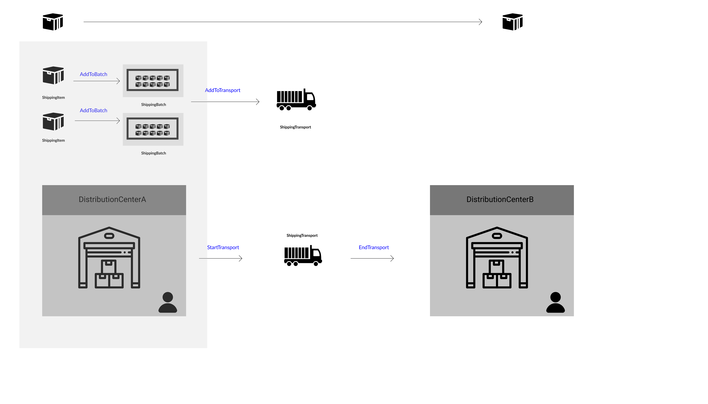
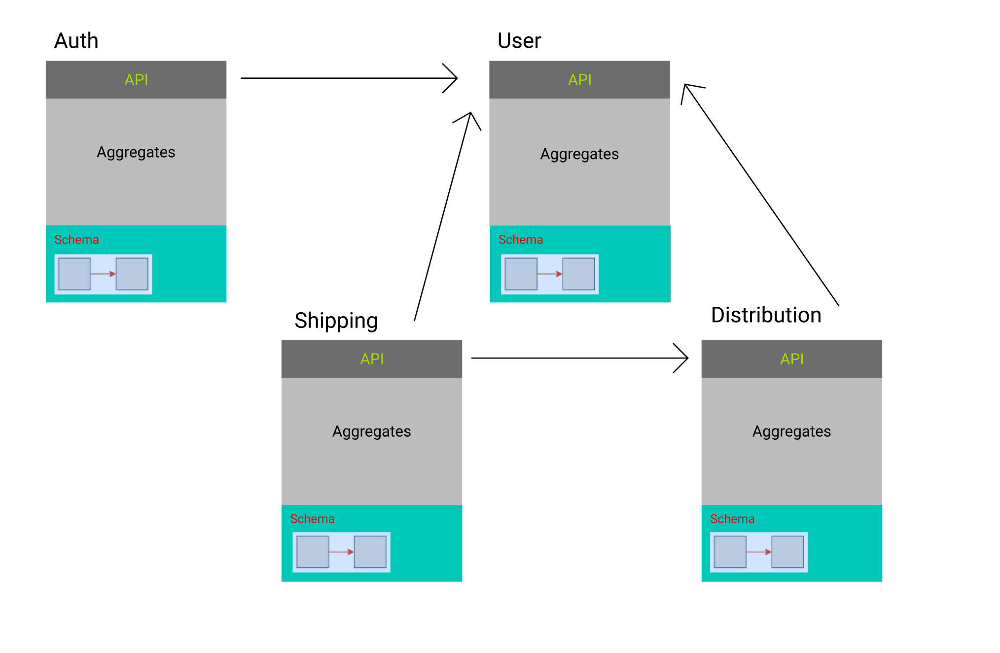
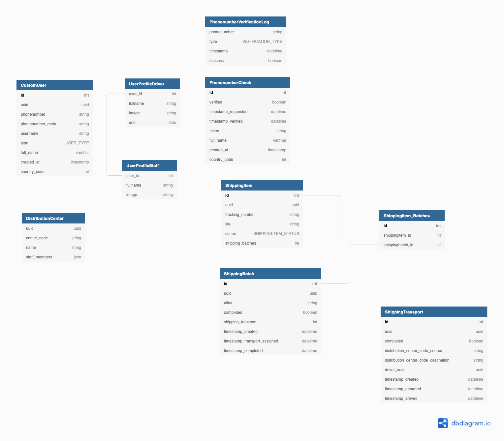
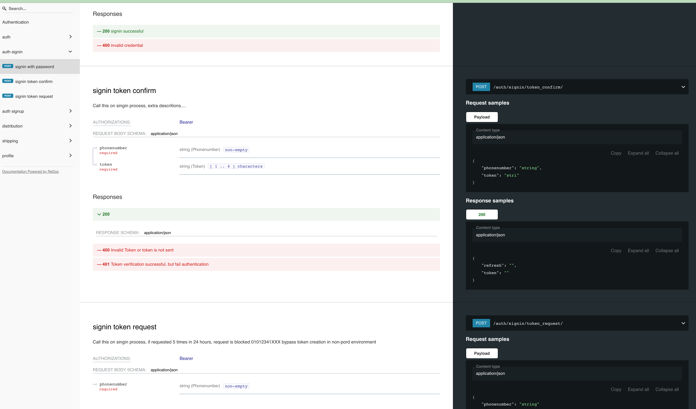
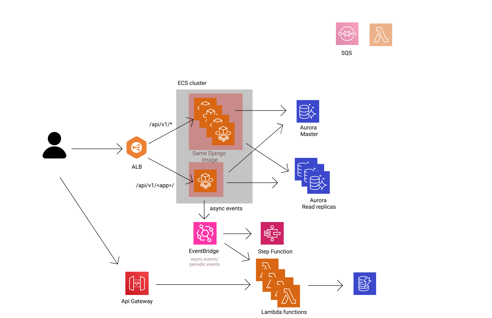

# majestic-monolith-django

## Introduction
This project is a starter django repo aiming to achieve majestic monolith architecture.
Main purpose is to provide scaffolding skeleton and sample architecture for
rapid prototype structure that can scale to mid-range size application.
I have complied useful techniques and libraries to help build backend API server.

Inspired by [Majestic monolith](https://m.signalvnoise.com/the-majestic-monolith/) and
[Two Scoops of Django](https://www.feldroy.com/books/two-scoops-of-django-3-x), this starter code will help you
build scalable application for a small team of developers.

## Why majestic modular monolith?
MicroService is everywhere and no doubt that they are the next big thing,
for a company with many developers and in need for concurrent feature releases.

However, MSA needs a lot of coordination and preparation to make is work.
If you are the only developer in the team or
developing ina a relatively small to medium scale architecture, MSA can be overwhelming.

You can reduce cognitive load by following DDD practice.
With code isolation, data isolation and some cloud architecture help,
majestic monolith django(MMD) can prepare for the scale and bigger team coordination.

## Sample application
This repo provides sample application illustrating following usecase.

I have broken down the application into four modules(`auth`, `user`, `shipping`, `distribution`) using techniques I used for application prototyping.

Please refer to ERD attached.

[dbdiagram.io](https://dbdiagram.io/d/6233d7ed0ac038740c54f8e2)
API doc can be accessed via (/api/docs/redoc) (you must login as staff)


## Infrastructure

I will provide base CDK template for deployment.(TBD)
I recommend to use seperate repository for CDK.
CDK incldues following modules
  - ECS cluster with django and nginx image
  - EventBridge
  - Aurora for Mysql
  - ALB

Refer to [infra setup](docs/infra_setup.md)

I will update rest of diagram in the future to support for scalable infrastructure
SAM
- API gateway
- Lambda
- dynamodb

## Features
- cache : REDIS
- authentication : JWT
- drf-yasg


### CI/CD
Github action
- CI
  - precommit
  - pytest using docker-compose
- CD
  - ECS deployment support

### pytest
You can run pytest on CLI:
```(project_root)/majestic-monolit-django/$ python -m pytest --ds=settings.test```
You can also run docker-compose to run pytest
```(project_root)/$ docker-compose -f docker-compose-test.yml up --build```


## Libraries
Project uses poetry for dependency management
Here are some of django packages used
- Django 3.2
- djangorestframework
- django-storages
- django-request-logging
- djangorestframework-simplejwt
- drf-yasg
- django-guid
- easy-thumbnails
- django-daterangefilter
- boto3
refer to [pyproject.toml](/config/app/pyproject.toml)


# How to Setup
Refer to [setup](docs/setup.md)
Refer to [infra setup](docs/infra_setup.md)


# Convention
Refer to [convention](docs/conventions.md)

## TODO List
Future updates are listed here.

[Projects](https://github.com/users/kokospapa8/projects/1/views/1)

## Contribution
I always welcome feedback and contribution. Please help me improve the project.

## Reference
- [Majestic monolith](https://m.signalvnoise.com/the-majestic-monolith/)
- [Majestic Modular Monoliths](https://lukashajdu.com/post/majestic-modular-monolith/)
- [Two Scoops of Django 3.x](https://www.feldroy.com/books/two-scoops-of-django-3-x)
- [cookie-cutter-django](https://github.com/cookiecutter/cookiecutter-django)

# Release
## version
- 0.1.0 initial application update with api

## release plan
- 0.2.0 cookie cutter
- 0.3.0 async support
